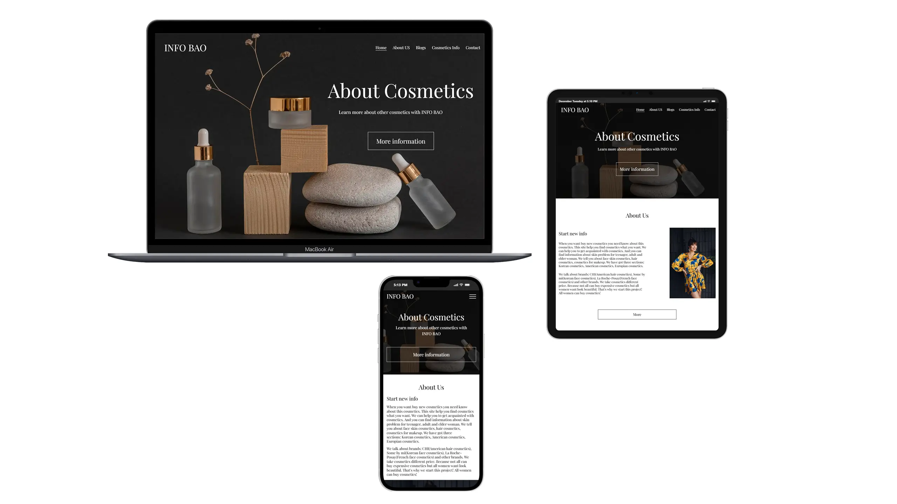

# Info-Bao

**Role:**  
Front-End Developer | Responsive Multi-page Website | UI/UX | Accessibility Optimization  

🌐 [View Live Project](https://oleksandrmul.github.io/info-bao/)

---

## Overview  
Developed a **multi-page informational website** focused on cosmetics for women, including skincare, haircare, makeup, and beauty routines. The platform is designed as a clean, minimalist guide that helps users explore cosmetic brands, product categories, and skin-related topics across different age groups. The multi-page structure supports SEO growth by attracting targeted traffic through category-based content.

---

## Key Achievements  
- ✅ Built a **fully responsive, multi-page structure** optimized for all screen sizes.  
- ✅ Applied **clean UI/UX principles** with interactive hover states for buttons, links, menus, and product cards.  
- ✅ Implemented **tabs for content organization** and better user navigation.  
- ✅ Developed a **Swiper slider on product pages**, allowing users to browse products without leaving the page.  
- ✅ Added a **preloader** to improve perceived loading experience.  
- ✅ Ensured full **accessibility compliance** for screen readers.  
- ✅ Optimized performance and semantic HTML structure for SEO and usability.

---

## Outcome  
Delivered a **lightweight, user-friendly cosmetic guide website** tailored for a female audience. The project combines clear navigation, responsive layouts, and interactive elements to create a pleasant browsing experience while supporting long-term SEO growth.

---

## Conclusions  
This project highlights the importance of **simplicity, accessibility, and structure** in content-driven websites. By focusing on responsive design, interactive UI elements, and SEO-friendly architecture, Info-Bao provides real value for users while remaining scalable for future content expansion.

If you’re looking for a developer who builds **clean, structured, and user-focused websites**, I’d be happy to collaborate.
